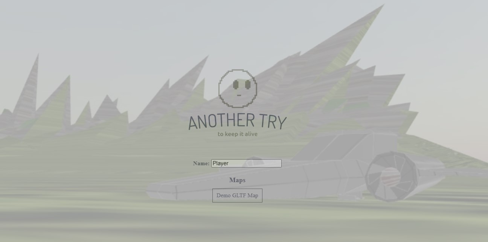
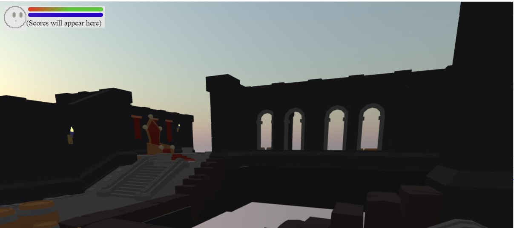
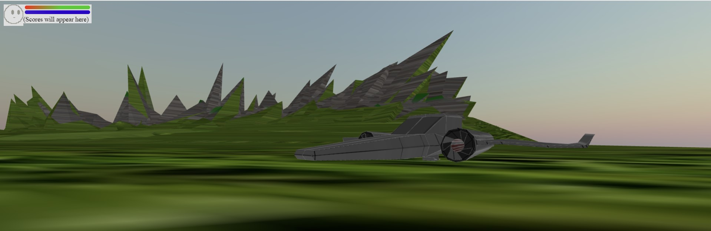

# Another Try

Another Try is a cutting-edge multiplayer FPS game, developed with the powerful THREE.js library in Typescript.

Dive deep into a world where the objective is simple: Keep it alive at all costs.


## Key Features
 - **Mysterious Entity**: As players, you are tasked with a unique mission; to guard an entity. But what is it? And why is it so crucial? Unravel the story as you play.
 - **Intense Multiplayer Action**: Team up with others or compete against them, but you never know that someone is your friend or your enemy. **Friendly fire is on.**
 - **Simple Graphics**: Using low polygon count and minimalist environment, you can be sure, that even your phone can power up the game.
 - **Offline/Online Game Modes**: You can run the game without internet access to practice or explore



## Requirements

### For Play
 - A modern web browser supporting WebGL 2.0.
 - (Optional) A stable internet connection for multiplayer action.

### Build and Contribute
Node JS, and NPM is required for this repository. The recommended NPM version is 9 (*currently installed: 9.8.0*), whereas the recommended Node version is 18 and up. (*currently installed 20.5.0*)

If you don't have node already, install node from here: <https://nodejs.org/en/download/> or use nvm (explained later) to control which version is currently installed.

To check your npm and node version after node was installed:
```shell
node --version
npm --version
```

### Start Client
1. Clone the project or download in a .zip
2. In the /client/ folder execute `npm install`
3. To run the live Dev Build: `npm run dev`
   1. To create build: `npm run build`

### Start Server
1. Clone the project or download in a .zip
2. In the /server/ folder execute `npm install`
3. To run the live Dev Build: `npm run start`
 1. To create build: `npm run build`


### Notes
This repository is under development and serves only learning purposes. I do not take responsibility for any errors, or issues connected to this repository, and it's content.


## Credits

 - [three-mesh-bvh](https://github.com/gkjohnson/three-mesh-bvh): character movement
